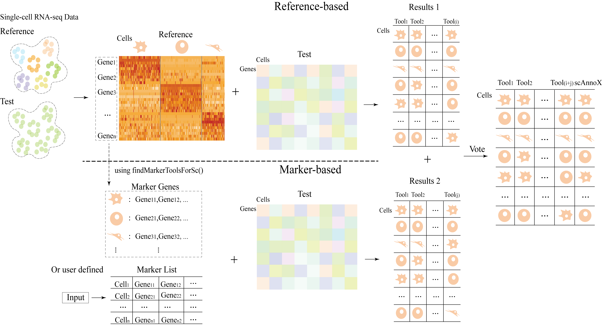
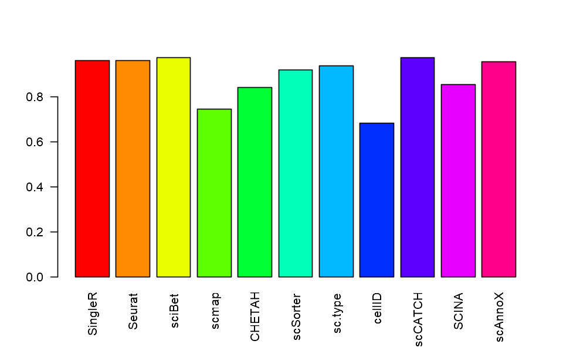

# scAnnoX - An R Package Integrating Multiple Public Tools for Single-Cell Annotation
scAnnoX is an R package that integrates 10 different cell identity algorithms for single-cell sequencing data into a unified framework, and allows comparison between different algorithms according to experimental results. Among them, 10 algorithms include SingleR, Seurat, sciBet, scmap, CHETAH, scSorter, sc.type, cellID, scCATCH, SCINA. It is designed to assist researchers to analyze scRNA-seq data more efficiently, so that they can make more informed decisions among the complex selection of single cell identification algorithms, and more easily test, evaluate, and compare multiple algorithms in an integrated environment.



# Install
To install scAnnoX,we recommed using "devtools":
```R
#install.packages("devtools")  
devtools::install_github('XQ-hub/scAnnoX')
```

# Prepare input data
```R
library(scAnnoX)
library(SingleCellExperiment)

# Import single cell profiles.
test.obj <- readRDS('data/test.obj')
ref.obj <- readRDS('data/ref.obj')
```

# Set parameters
| Parameters   | Description |
| ------------ | ------------------------------------------ |
| obj.seu      | Seurat object, which needs to be annotated. |
| ref.obj      | Seurat object, only when used with refernce-based tools. Default: NULL.  |
| ref.ctype    | The cell type column in ref.obj, only when used with refernce-based tools. Default: NULL.   |
| marker.lst   | A list contained maker genes for each cell type for marker based tool.   |
| method       | A vector of automated annotation tools.   |
| select.marker| Specify method for inferring markers for each subset. Default: Seurat.  |
| top.k        | Top k expressed genes of each subset remained. Default: NULL.  |
| strategy     | Category of single cell annotation tool.   |

# Single cell annotation via scAnnoX
Exclusively employed a singular single-cell annotation tool.
```R
# Take one of the refernce-based annotation tools for example.
pred.obj <- autoAnnoTools(
    test.obj,
    ref.obj = ref.obj,
    ref.ctype = 'CellType',
    marker.lst = marker.lst,
    method = 'SingleR',
    select.marker = 'Seurat',
    top.k = 30,
    strategy = 'refernce-based'
) 

# Take one of the marker-based annotation tools for example.
Idents(ref.obj) <- ref.obj$CellType
marker.lst <- findMarkerToolsForSc(ref.obj, to.list = TRUE, top.k = 30)
pred.obj <- autoAnnoTools(
    test.obj,
    ref.obj = ref.obj,
    ref.ctype = 'CellType',
    marker.lst = marker.lst,
    method = 'SCINA',
    select.marker = 'Seurat',
    top.k = 30,
    strategy = 'marker-based'
) 
```

Employed a multitude of single-cell annotation tools.

Assembling a vector of diverse annotation tools and iteratively annotating the tools within the vector, we generate annotation results encompassing a variety of tools.
```R
Idents(ref.obj) <- ref.obj$CellType
marker.lst <- findMarkerToolsForSc(ref.obj, to.list = TRUE, top.k = 30)

anno.tools <- c('SingleR', 'Seurat', 'sciBet', 'scmap', 'CHETAH', 'scSorter', 'sc.type', 'cellID', 'scCATCH', 'SCINA')
marker.based <- c('scSorter', 'sc.type', 'cellID', 'scCATCH', 'SCINA')

anno.res <- lapply(anno.tools, function(tool) {
    print(sprintf('Running %s...\n', tool))
    bool.val <- ifelse(tool %in% marker.based, 'marker-based', 'refernce-based')
    
    tmp.obj <- autoAnnoTools(
        test.obj,
        ref.obj = ref.obj,
        ref.ctype = 'CellType',
        marker.lst = marker.lst,
        method = tool,
        select.marker = 'Seurat',
        top.k = 30,
        strategy = bool.val
    ) 
    tmp.obj@meta.data[, ncol(tmp.obj@meta.data)]
}) %>% do.call(cbind, .) %>% `colnames<-`(anno.tools)

scAnnoX <- annoResult(anno.res)
head(scAnnoX)

A data.frame: 6 × 11
SingleR	Seurat	sciBet	scmap	CHETAH	scSorter	sc.type	cellID	scCATCH	SCINA	scAnnoX
<chr>	<chr>	<chr>	<chr>	<chr>	<chr>	<chr>	<chr>	<chr>	<chr>	<chr>
1	HE	HE	HE	HE	HE	HE	HE	unassigned	HE	HE	HE
2	EC	EC	EC	EC	EC	EC	EC	EC	EC	EC	EC
3	HE	HE	HE	HE	HE	HE	HE	HE	HE	HE	HE
4	EC-LB	EC-LB	EC-LB	EC-LB	Node3	EC-LB	EC-LB	EC-LB	EC-LB	EC-LB	EC-LB
5	MC-LB	MC-LB	MC-LB	MC-LB	MC-LB	MC-LB	MC-LB	MC-LB	MC-LB	MC-LB	MC-LB
6	HE-LB	HE	HE-LB	unassigned	Node4	HE	HE	unassigned	HE-LB	HE	HE

```

# Visualization
Show annotation results.
```R
acc <- apply(scAnnoX, 2, function(xx) sum(test.obj$CellType == xx) / ncol(test.obj))
barplot(acc, las = 2 , col = rainbow(11))
```



# Contributors
scAnnoX was developed by Xiaoqian Huang. Please contact Xiaoqian Huang for any questions or suggestions.

# SessionInfo
```R
R version 4.2.2 (2022-10-31 ucrt)
Platform: x86_64-w64-mingw32/x64 (64-bit)
Running under: Windows 10 x64 (build 22000)

Matrix products: default

locale:
[1] LC_COLLATE=Chinese (Simplified)_China.utf8  LC_CTYPE=Chinese (Simplified)_China.utf8   
[3] LC_MONETARY=Chinese (Simplified)_China.utf8 LC_NUMERIC=C                               
[5] LC_TIME=Chinese (Simplified)_China.utf8    

attached base packages:
[1] stats     graphics  grDevices utils     datasets  methods   base     

loaded via a namespace (and not attached):
 [1] Rcpp_1.0.10       compiler_4.2.2    later_1.3.1       urlchecker_1.0.1  prettyunits_1.1.1
 [6] profvis_0.3.8     remotes_2.4.2.1   tools_4.2.2       digest_0.6.31     pkgbuild_1.4.2   
[11] pkgload_1.3.2.1   memoise_2.0.1     lifecycle_1.0.3   rlang_1.1.1       shiny_1.7.4.1    
[16] cli_3.6.0         rstudioapi_0.15.0 curl_5.0.0        fastmap_1.1.1     stringr_1.5.0    
[21] desc_1.4.2        fs_1.6.2          htmlwidgets_1.6.2 vctrs_0.6.3       devtools_2.4.5   
[26] rprojroot_2.0.3   glue_1.6.2        R6_2.5.1          processx_3.8.2    sessioninfo_1.2.2
[31] callr_3.7.3       purrr_1.0.1       magrittr_2.0.3    ps_1.7.5          promises_1.2.0.1 
[36] ellipsis_0.3.2    htmltools_0.5.5   usethis_2.2.2     mime_0.12         xtable_1.8-4     
[41] httpuv_1.6.11     stringi_1.7.12    miniUI_0.1.1.1    cachem_1.0.7      crayon_1.5.2 
```